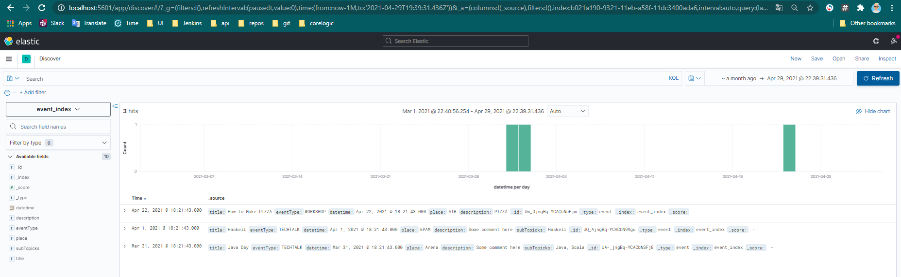
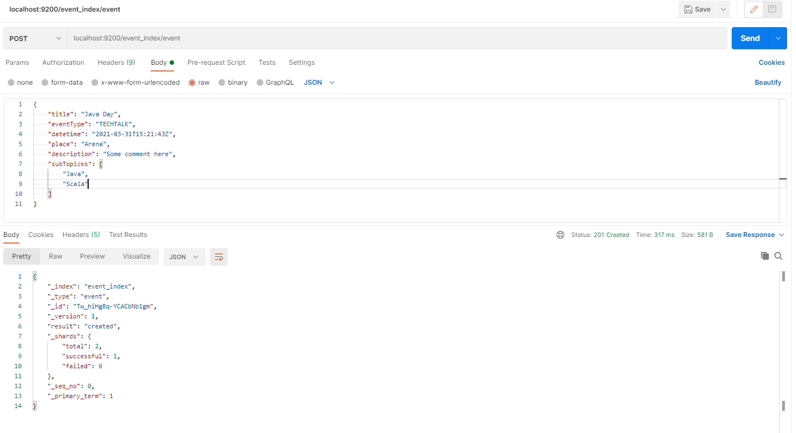
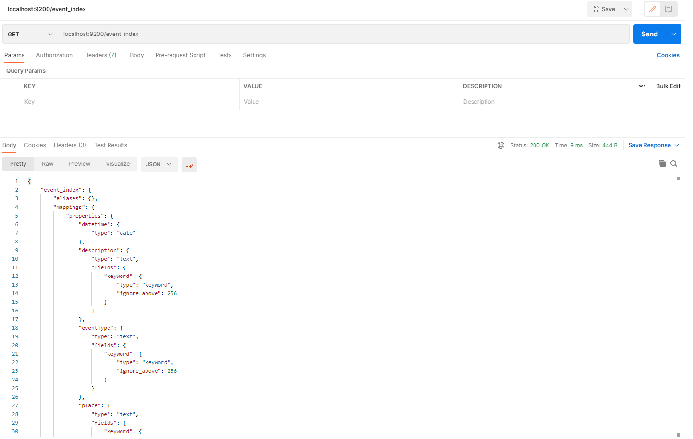

##Kibana dashboard


##Request result

<details><summary>Store Event Object request</summary>




```http request

POST http://localhost:9200/event_index/event
201 317 ms POST /event_index/event HTTP/1.1 Content-Type: application/json User-Agent: PostmanRuntime/7.26.10 Accept: *
/*
Cache-Control: no-cache Postman-Token: e7267390-0668-44c0-937f-48a44dde77dd Host: localhost:9200 Accept-Encoding: gzip,
deflate, br Connection: keep-alive Content-Length: 227 {
"title": "Java Day",
"eventType": "TECHTALK",
"datetime": "2021-03-31T15:21:43Z",
"place": "Arena",
"description": "Some comment here",
"subTopicks": [
"Java",
"Scala"
]
} HTTP/1.1 201 Created Location: /event_index/event/Tw_hiHgBq-YCACbNb1gm Warning: 299
Elasticsearch-7.11.1-ff17057114c2199c9c1bbecc727003a907c0db7a "[types removal] Specifying types in document index
requests is deprecated, use the typeless endpoints instead (/{index}/_doc/{id}, /{index}/_doc, or /{index}/_create/{id})
."
content-type: application/json; charset=UTF-8 content-encoding: gzip content-length: 163 {"_index":"event_index","_
type":"event","_id":"Tw_hiHgBq-YCACbNb1gm","_version":1,"result":"created","_shards":{"total":2,"successful":1,"failed":
0},"_seq_no":0,"_primary_term":1}
```
</details>

<details><summary>Get All Event Objects request</summary>


```http request
GET http://localhost:9200/event_index
200 11 ms GET /event_index HTTP/1.1 User-Agent: PostmanRuntime/7.26.10 Accept: */*
Cache-Control: no-cache Postman-Token: dd7238f5-e23b-43d4-9fd4-ad422c85ac3e Host: localhost:9200 Accept-Encoding: gzip,
deflate, br Connection: keep-alive HTTP/1.1 200 OK content-type: application/json; charset=UTF-8 content-encoding: gzip
content-length: 333 {"event_index":{"aliases":{},"mappings":{"properties":{"datetime":{"type":"date"},"description":{"
type":"text","fields":{"keyword":{"type":"keyword","ignore_above":256}}},"eventType":{"type":"text","fields":{"keyword":
{"type":"keyword","ignore_above":256}}},"place":{"type":"text","fields":{"keyword":{"type":"keyword","ignore_above":
256}}},"subTopicks":{"type":"text","fields":{"keyword":{"type":"keyword","ignore_above":256}}},"title":{"type":"text","
fields":{"keyword":{"type":"keyword","ignore_above":256}}}}},"settings":{"index":{"routing":{"allocation":{"include":{"_
tier_preference":"data_content"}}},"number_of_shards":"1","provided_name":"event_index","creation_date":"1617204178518"
,"number_of_replicas":"1","uuid":"_hiJe2g-S46VaLGKlZ1Nlw","version":{"created":"7110199"}}}}}

GET http://localhost:9200/event_index/event/_search
200 11 ms GET /event_index/event/_search HTTP/1.1 User-Agent: PostmanRuntime/7.26.10 Accept: */*
Cache-Control: no-cache Postman-Token: 6b054d07-37a8-43af-b83c-2a271367ae29 Host: localhost:9200 Accept-Encoding: gzip,
deflate, br Connection: keep-alive HTTP/1.1 200 OK Warning: 299
Elasticsearch-7.11.1-ff17057114c2199c9c1bbecc727003a907c0db7a "[types removal] Specifying types in search requests is
deprecated."
content-type: application/json; charset=UTF-8 content-encoding: gzip content-length: 327 {"took":2,"timed_out":false,"_
shards":{"total":1,"successful":1,"skipped":0,"failed":0},"hits":{"total":{"value":1,"relation":"eq"},"max_score":1.0,"
hits":[{"_index":"event_index","_type":"event","_id":"Tw_hiHgBq-YCACbNb1gm","_score":1.0,"_source":{
"title": "Java Day",
"eventType": "TECHTALK",
"datetime": "2021-03-31T15:21:43Z",
"place": "Arena",
"description": "Some comment here",
"subTopicks": [
"Java",
"Scala"
]
}}]}}
```
</details>


<details><summary>Get By Id Event Object request</summary>

```http request
GET http://localhost:9200/event_index/_doc/Tw_hiHgBq-YCACbNb1gm
200 7 ms GET /event_index/_doc/Tw_hiHgBq-YCACbNb1gm HTTP/1.1 User-Agent: PostmanRuntime/7.26.10 Accept: */*
Cache-Control: no-cache Postman-Token: eeba57b0-f042-4ebc-a8ca-a2ae221f34b3 Host: localhost:9200 Accept-Encoding: gzip,
deflate, br Connection: keep-alive HTTP/1.1 200 OK content-type: application/json; charset=UTF-8 content-encoding: gzip
content-length: 269 {"_index":"event_index","_type":"_doc","_id":"Tw_hiHgBq-YCACbNb1gm","_version":1,"_seq_no":0,"_
primary_term":1,"found":true,"_source":{
"title": "Java Day",
"eventType": "TECHTALK",
"datetime": "2021-03-31T15:21:43Z",
"place": "Arena",
"description": "Some comment here",
"subTopicks": [
"Java",
"Scala"
]
}}
```
</details>


<details><summary>Partial Update Event Objects request</summary>

```http request

POST http://localhost:9200/event_index/_update/Tw_hiHgBq-YCACbNb1gm
200 78 ms POST /event_index/_update/Tw_hiHgBq-YCACbNb1gm HTTP/1.1 Content-Type: application/json User-Agent:
PostmanRuntime/7.26.10 Accept: */*
Cache-Control: no-cache Postman-Token: 550031eb-610e-4716-99dd-cd379acdb9aa Host: localhost:9200 Accept-Encoding: gzip,
deflate, br Connection: keep-alive Content-Length: 90 {
"doc": {
"title": "Kotlin Day",
"eventType": "WORKSHOP"
} } HTTP/1.1 200 OK content-type: application/json; charset=UTF-8 content-encoding: gzip content-length: 161 {"_index":"
event_index","_type":"_doc","_id":"Tw_hiHgBq-YCACbNb1gm","_version":2,"result":"updated","_shards":{"total":2,"
successful":1,"failed":0},"_seq_no":1,"_primary_term":1}
```
```http request
GET http://localhost:9200/event_index/_doc/Tw_hiHgBq-YCACbNb1gm
200 102 ms GET /event_index/_doc/Tw_hiHgBq-YCACbNb1gm HTTP/1.1 User-Agent: PostmanRuntime/7.26.10 Accept: */*
Cache-Control: no-cache Postman-Token: e277ff8b-f543-49b3-bb0d-82abc57b9a62 Host: localhost:9200 Accept-Encoding: gzip,
deflate, br Connection: keep-alive HTTP/1.1 200 OK content-type: application/json; charset=UTF-8 content-encoding: gzip
content-length: 246 {"_index":"event_index","_type":"_doc","_id":"Tw_hiHgBq-YCACbNb1gm","_version":2,"_seq_no":1,"_
primary_term":1,"found":true,"_source":{"title":"Kotlin Day","eventType":"WORKSHOP","datetime":"2021-03-31T15:21:43Z","
place":"Arena","description":"Some comment here","subTopicks":["Java","Scala"]}}
```
</details>


<details><summary>Full Update Event Object request</summary>

```http request
PUT http://localhost:9200/event_index/_doc/Tw_hiHgBq-YCACbNb1gm
200 28 ms PUT /event_index/_doc/Tw_hiHgBq-YCACbNb1gm HTTP/1.1 Content-Type: application/json User-Agent:
PostmanRuntime/7.26.10 Accept: */*
Cache-Control: no-cache Postman-Token: 745cfd42-2add-4170-b32b-2d44070b3ef2 Host: localhost:9200 Accept-Encoding: gzip,
deflate, br Connection: keep-alive Content-Length: 69 {
"title": "Kotlin Day",
"eventType": "WORKSHOP"
} HTTP/1.1 200 OK content-type: application/json; charset=UTF-8 content-encoding: gzip content-length: 165 {"_index":"
event_index","_type":"_doc","_id":"Tw_hiHgBq-YCACbNb1gm","_version":3,"result":"updated","_shards":{"total":2,"
successful":1,"failed":0},"_seq_no":2,"_primary_term":1}
```
```http request
GET http://localhost:9200/event_index/_doc/Tw_hiHgBq-YCACbNb1gm
200 12 ms GET /event_index/_doc/Tw_hiHgBq-YCACbNb1gm HTTP/1.1 User-Agent: PostmanRuntime/7.26.10 Accept: */*
Cache-Control: no-cache Postman-Token: 32b25dfa-56e2-463f-8ca4-00a26e8cad87 Host: localhost:9200 Accept-Encoding: gzip,
deflate, br Connection: keep-alive HTTP/1.1 200 OK content-type: application/json; charset=UTF-8 content-encoding: gzip
content-length: 187 {"_index":"event_index","_type":"_doc","_id":"Tw_hiHgBq-YCACbNb1gm","_version":3,"_seq_no":2,"_
primary_term":1,"found":true,"_source":{
"title": "Kotlin Day",
"eventType": "WORKSHOP"
}}
```
</details>

<details><summary>Get All Event Objects request</summary>

```http request
GET http://localhost:9200/event_index/_search
200 73 ms GET /event_index/_search HTTP/1.1 User-Agent: PostmanRuntime/7.26.10 Accept: */*
Cache-Control: no-cache Postman-Token: 7f4b1df0-00d8-4c68-90f0-1677683ec043 Host: localhost:9200 Accept-Encoding: gzip,
deflate, br Connection: keep-alive HTTP/1.1 200 OK content-type: application/json; charset=UTF-8 content-encoding: gzip
content-length: 475 {"took":67,"timed_out":false,"_shards":{"total":1,"successful":1,"skipped":0,"failed":0},"hits":{"
total":{"value":4,"relation":"eq"},"max_score":1.0,"hits":[{"_index":"event_index","_type":"event","_id":"
Tw_hiHgBq-YCACbNb1gm","_score":1.0,"_source":{
"title": "Kotlin Day",
"eventType": "WORKSHOP"
}},{"_index":"event_index","_type":"event","_id":"UA-_jngBq-YCACbNSFjE","_score":1.0,"_source":{
"title": "Java Day",
"eventType": "TECHTALK",
"datetime": "2021-03-31T15:21:43Z",
"place": "Arena",
"description": "Some comment here",
"subTopicks": [
"Java",
"Scala"
]
}},{"_index":"event_index","_type":"event","_id":"UQ_AjngBq-YCACbN9Vgu","_score":1.0,"_source":{
"title": "Haskell",
"eventType": "TECHTALK",
"datetime": "2021-04-01T15:21:43Z",
"place": "EPAM",
"description": "Some comment here",
"subTopicks": [
"Haskell"
]
}},{"_index":"event_index","_type":"event","_id":"Uw_DjngBq-YCACbNcFjm","_score":1.0,"_source":{
"title": "How to Make PIZZA",
"eventType": "WORKSHOP",
"datetime": "2021-04-22T15:21:43Z",
"place": "ATB",
"description": "PIZZA"
}}]}}
```

<details><summary>Only Workshop Event Objects request</summary>

```http request

GET http://localhost:9200/event_index/_search
200 124 ms GET /event_index/_search HTTP/1.1 Content-Type: application/json User-Agent: PostmanRuntime/7.26.10 Accept: *
/*
Cache-Control: no-cache Postman-Token: 30e4ed35-7e4a-400c-8361-51adce08ef3d Host: localhost:9200 Accept-Encoding: gzip,
deflate, br Connection: keep-alive Content-Length: 137 {
"query": {
"query_string": {
"fields": [
"eventType"
],
"query": "WORKSHOP"
} } } HTTP/1.1 200 OK content-type: application/json; charset=UTF-8 content-encoding: gzip content-length: 348 {"took":
92,"timed_out":false,"_shards":{"total":1,"successful":1,"skipped":0,"failed":0},"hits":{"total":{"value":2,"relation":"
eq"},"max_score":0.6931471,"
hits":[{"_index":"event_index","_type":"event","_id":"Tw_hiHgBq-YCACbNb1gm","_score":0.6931471,"_source":{
"title": "Kotlin Day",
"eventType": "WORKSHOP"
}},{"_index":"event_index","_type":"event","_id":"Uw_DjngBq-YCACbNcFjm","_score":0.6931471,"_source":{
"title": "How to Make PIZZA",
"eventType": "WORKSHOP",
"datetime": "2021-04-22T15:21:43Z",
"place": "ATB",
"description": "PIZZA"
}}]}}
```

<details><summary>Search By Title Event Objects request</summary>

```http request
GET http://localhost:9200/event_index/_search
200 50 ms GET /event_index/_search HTTP/1.1 Content-Type: application/json User-Agent: PostmanRuntime/7.26.10 Accept: *
/*
Cache-Control: no-cache Postman-Token: 76f84449-e15b-4025-ac40-b8c9367e7f7e Host: localhost:9200 Accept-Encoding: gzip,
deflate, br Connection: keep-alive Content-Length: 131 {
"query": {
"query_string": {
"fields": [
"title"
],
"query": "*Java*"
} } } HTTP/1.1 200 OK content-type: application/json; charset=UTF-8 content-encoding: gzip content-length: 329 {"took":
43,"timed_out":false,"_shards":{"total":1,"successful":1,"skipped":0,"failed":0},"hits":{"total":{"value":1,"relation":"
eq"},"max_score":1.0,"hits":[{"_index":"event_index","_type":"event","_id":"UA-_jngBq-YCACbNSFjE","_score":1.0,"_
source":{
"title": "Java Day",
"eventType": "TECHTALK",
"datetime": "2021-03-31T15:21:43Z",
"place": "Arena",
"description": "Some comment here",
"subTopicks": [
"Java",
"Scala"
]
}}]}}
```

<details><summary>Search By Date and Title Event Objects request</summary>

```http request

BY DATE AND TITLE GET http://localhost:9200/event_index/_search
200 12 ms GET /event_index/_search HTTP/1.1 Content-Type: application/json User-Agent: PostmanRuntime/7.26.10 Accept: *
/*
Cache-Control: no-cache Postman-Token: ec592e2a-42a8-4244-b07b-a739949ca0d3 Host: localhost:9200 Accept-Encoding: gzip,
deflate, br Connection: keep-alive Content-Length: 133 {
"query": {
"query_string": {
"query": "datetime > 2021-04-01 AND title:*Haskell*"
} } } HTTP/1.1 200 OK content-type: application/json; charset=UTF-8 content-encoding: gzip content-length: 323 {"took":
7,"timed_out":false,"_shards":{"total":1,"successful":1,"skipped":0,"failed":0},"hits":{"total":{"value":1,"relation":"
eq"},"max_score":2.0,"hits":[{"_index":"event_index","_type":"event","_id":"UQ_AjngBq-YCACbN9Vgu","_score":2.0,"_
source":{
"title": "Haskell",
"eventType": "TECHTALK",
"datetime": "2021-04-01T15:21:43Z",
"place": "EPAM",
"description": "Some comment here",
"subTopicks": [
"Haskell"
]
}}]}}
```

<details><summary>Calculate amount of events for each event type request</summary>

```http request

AGG GET http://localhost:9200/event_index/_search
200 10 ms GET /event_index/_search HTTP/1.1 Content-Type: application/json User-Agent: PostmanRuntime/7.26.10 Accept: *
/*
Cache-Control: no-cache Postman-Token: 0556e333-3957-406a-aefa-76a2e376a059 Host: localhost:9200 Accept-Encoding: gzip,
deflate, br Connection: keep-alive Content-Length: 143 {
"aggs": {
"events": {
"terms": {
"field": "eventType.keyword"
} } } } HTTP/1.1 200 OK content-type: application/json; charset=UTF-8 content-encoding: gzip content-length: 547 {"
took":2,"timed_out":false,"_shards":{"total":1,"successful":1,"skipped":0,"failed":0},"hits":{"total":{"value":4,"
relation":"eq"},"max_score":1.0,"hits":[{"_index":"event_index","_type":"event","_id":"Tw_hiHgBq-YCACbNb1gm","_score":
1.0,"_source":{
"title": "Kotlin Day",
"eventType": "WORKSHOP"
}},{"_index":"event_index","_type":"event","_id":"UA-_jngBq-YCACbNSFjE","_score":1.0,"_source":{
"title": "Java Day",
"eventType": "TECHTALK",
"datetime": "2021-03-31T15:21:43Z",
"place": "Arena",
"description": "Some comment here",
"subTopicks": [
"Java",
"Scala"
]
}},{"_index":"event_index","_type":"event","_id":"UQ_AjngBq-YCACbN9Vgu","_score":1.0,"_source":{
"title": "Haskell",
"eventType": "TECHTALK",
"datetime": "2021-04-01T15:21:43Z",
"place": "EPAM",
"description": "Some comment here",
"subTopicks": [
"Haskell"
]
}},{"_index":"event_index","_type":"event","_id":"Uw_DjngBq-YCACbNcFjm","_score":1.0,"_source":{
"title": "How to Make PIZZA",
"eventType": "WORKSHOP",
"datetime": "2021-04-22T15:21:43Z",
"place": "ATB",
"description": "PIZZA"
}}]},"aggregations":{"events":{"doc_count_error_upper_bound":0,"sum_other_doc_count":0,"
buckets":[{"key":"TECHTALK","doc_count":2},{"key":"WORKSHOP","doc_count":2}]}}}
```

<details><summary>Delete All Event Objects request</summary>

```http request
DELETE http://localhost:9200/*
200 511 ms DELETE /* HTTP/1.1 User-Agent: PostmanRuntime/7.26.10 Accept: */*
Cache-Control: no-cache Postman-Token: 57ac68f8-96ee-49cc-9bd8-fd90dae5d058 Host: localhost:9200 Accept-Encoding: gzip,
deflate, br Connection: keep-alive HTTP/1.1 200 OK Warning: 299
Elasticsearch-7.11.1-ff17057114c2199c9c1bbecc727003a907c0db7a "this request accesses system
indices: [.apm-agent-configuration, .apm-custom-link, .async-search, .kibana_1, .kibana_2, .kibana_task_manager_1, .tasks]
, but in a future major version, direct access to system indices will be prevented by default"
content-type: application/json; charset=UTF-8 content-encoding: gzip content-length: 47 {"acknowledged":true}
```
